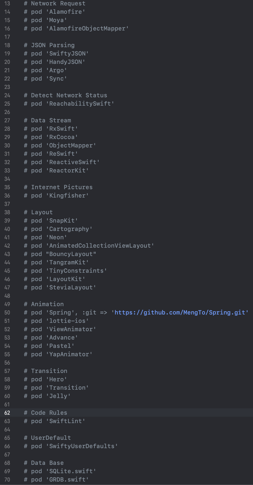

# PodfileKit
========================

[](https://developer.apple.com/iphone/index.action)
[](https://developer.apple.com/swift)
[](http://mit-license.org)
[](https://github.com/adong666666/PodfileKit/issues?state=open)
[](https://www.apple.com/nl/ios/)
[]()
[](https://github.com/adong666666/PodfileKit/stargazers)

Easy Podfile !

PodfileKit summarizes the common iOS (Swift) third-party frameworks on GitHub, and classifies the frameworks, which provides convenience for users to manage the third-party frameworks.
##### 简体中文: [中文文档](README.md) 
- [Set up Platform](#set-up-platform)
- [Designated Third Party framework](#designated-third-party-framework)
- [Framework Classification](#framework-classification)
- [Subframework](#subframework)
- [Set up groups](#set-up-groups)
- [Use](#use)
- [Contributing](#contributing)
- [License](#license)
## Set up Platform
`platform:ios '13.0'`. The `'13.0'`here is the lowest iOS system version that the app can support. You can replace it with `'11.0', '12.3' , '14.0'`and so on.


## Designated Third Party framework
`Pod 'ARVideoKit'` specifies a framework named `'ARVideoKit'` to download. You can replace `'ARVideoKit'` with `'name of the framework you want to install'`. Specify the corresponding URL by `: git = >`, specify the corresponding branch by `: Branch = >`, specify the submitted version by `commit:`, specify the marked submitted version by `: tag = >`, and specify the submitted version by `: inhibit'_ Warnings = > true ` to avoid warnings from a single framework. Of course, the relevant specifications after `pod' ARVideoKit` can be omitted. In this way, you will download the default version of the framework, which is generally the latest version suitable for your project.

## Framework Classification
The frameworks are classified, you can also classify according to your own preferences.

When there is a framework you need to use in the classification, you can delete "\#".

## Subframework
For some frameworks, if only some of the functions in the framework are used, it is not necessary to download the whole framework, only its sub frameworks.


## Set up groups
You can use
```
def groupName 
 pod ...
 ...
end
```
to set up groups, for example, some frameworks are used for debugging, some frameworks are used for app publishing, and some frameworks are special. After `target`, you need to replace `ProjectName` with the name of your project.

## Use
* Clone the repository to get the `PodFile` file in the repository
* Directly download the `PodFile` in the repository and put it under the directory of the project folder
* Copy the contents of the `PodFile` in the repository to your own generated `PodFile`
* Use the terminal to open the project directory and run the following command
```
$ pod install
```
## Contributing
* Fork it !
* Create your feature branch: `git checkout -b my-new-feature`
* Commit your changes: `git commit -am 'Add some feature'`
* Push to the branch: `git push origin my-new-feature`
* Submit a pull request
## License
PodfileKit is released under the MIT license. [See LICENSE](https://github.com/adong666666/PodfileKit/blob/master/LICENSE) for details.
