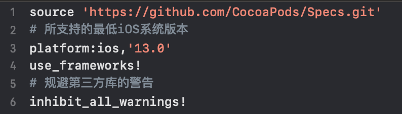
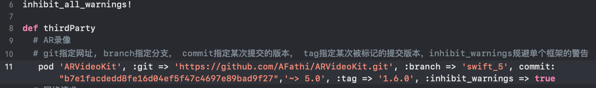
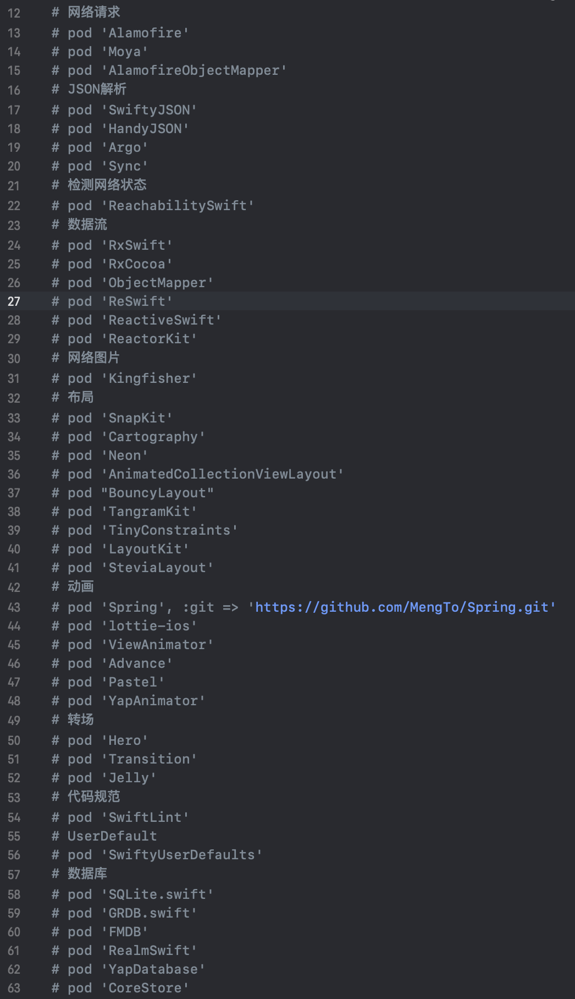
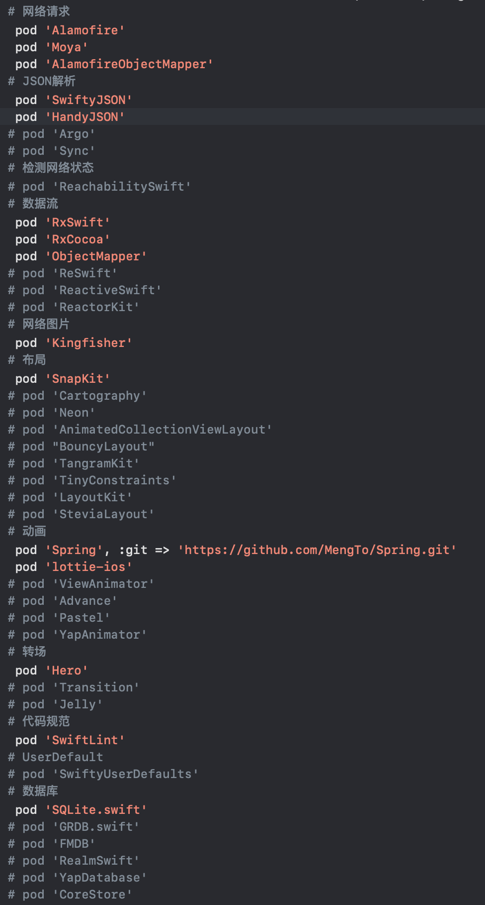
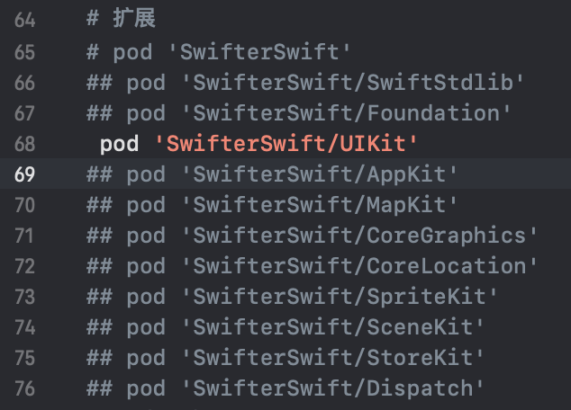
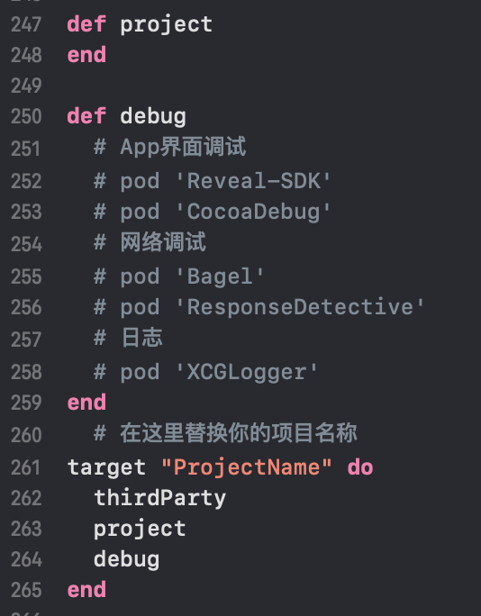

# PodfileKit
========================

[](https://developer.apple.com/iphone/index.action)
[](https://developer.apple.com/swift)
[](http://mit-license.org)
[](https://github.com/adong666666/PodfileKit/issues?state=open)
[](https://www.apple.com/nl/ios/)
[]()
[](https://github.com/adong666666/PodfileKit/stargazers)

Easy Podfile !

PodfileKit将github上常见的iOS(Swift)第三方框架进行了汇总，并且将框架进行了分类，为用户管理第三方框架提供了方便。
##### English: [English Document](README.en.md) 
- [设置平台](#设置平台)
- [指定第三方框架](#指定第三方框架)
- [框架分类](#框架分类)
- [子框架](#子框架)
- [建立分组](#建立分组)
- [使用](#使用)
- [贡献](#贡献)
- [License](#license)
## 设置平台
`platform:ios,'13.0'`，这里的`‘13.0’`是App所能支持的最低iOS系统版本，你可以替换为`‘11.0’、'12.3'、‘14.0’`等版本。

## 指定第三方框架
`pod 'ARVideoKit'`指定名为`‘ARVideoKit’`的框架进行下载，你可以将`‘ARVideoKit’`替换为`‘你想要安装的框架的名称’`。通过`:git =>`来指定相应网址，通过`:branch =>`来指定相应分支，通过`commit:`来指定某次提交的版本，通过`:tag =>`来指定某次被标记的提交版本，通过`:inhibit_warnings => true`来规避单个框架的警告。当然，`pod 'ARVideoKit'`之后的相关指定都可以被省略，这样你将会下载该框架的默认版本，一般为适合你工程的最新版本。

## 框架分类
对框架进行了分类，你也可以根据自己的喜好进行分类。

当分类中有你需要使用的框架时，便将”\#“删除即可。

## 子框架
对于某些框架，如果只用到框架中部分功能，则不必下载整个框架，只需下载其子框架。

## 建立分组
你可以使用
```
def groupName 
 pod ...
 ...
end
```
来建立分组，比如某些框架是用于调试的，某些框架是用于App发布的，某些框架比较特殊等。在`target`之后，你需要将`ProjectName`替换为你项目的名称。

## 使用
* 克隆本仓库，从而拿到仓库中的`PodFile`文件
* 直接下载本仓库中的`PodFile`，置于工程文件夹的目录之下
* 拷贝本仓库中`PodFile`的内容到你自己生成的`PodFile`文件中
* 使用终端打开工程所在目录，运行如下命令
```
$ pod install
```
## 贡献
* Fork it !
* Create your feature branch: `git checkout -b my-new-feature`
* Commit your changes: `git commit -am 'Add some feature'`
* Push to the branch: `git push origin my-new-feature`
* Submit a pull request
## License
PodfileKit is released under the MIT license. [See LICENSE](https://github.com/adong666666/PodfileKit/blob/master/LICENSE) for details.
